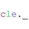

## binarySubtract


Subtracts one binary image from another.

Categories: [Math](https://clij.github.io/clij2-docs/reference__math), [Binary](https://clij.github.io/clij2-docs/reference__binary)

### Usage in ImageJ macro
```
Ext.CLIJ2_binarySubtract(Image minuend, Image subtrahend, Image destination);
```


### Usage in object oriented programming languages


<details>

<summary>
Java
</summary>
<pre class="highlight">// init CLIJ and GPU
import net.haesleinhuepf.clij2.CLIJ2;
import net.haesleinhuepf.clij.clearcl.ClearCLBuffer;
CLIJ2 clij2 = CLIJ2.getInstance();

// get input parameters
ClearCLBuffer minuend = clij2.push(minuendImagePlus);
ClearCLBuffer subtrahend = clij2.push(subtrahendImagePlus);
destination = clij2.create(minuend);
</pre>

<pre class="highlight">
// Execute operation on GPU
clij2.binarySubtract(minuend, subtrahend, destination);
</pre>

<pre class="highlight">
// show result
destinationImagePlus = clij2.pull(destination);
destinationImagePlus.show();

// cleanup memory on GPU
clij2.release(minuend);
clij2.release(subtrahend);
clij2.release(destination);
</pre>

</details>


<details>

<summary>
Matlab
</summary>
<pre class="highlight">% init CLIJ and GPU
clij2 = init_clatlab();

% get input parameters
minuend = clij2.pushMat(minuend_matrix);
subtrahend = clij2.pushMat(subtrahend_matrix);
destination = clij2.create(minuend);
</pre>

<pre class="highlight">
% Execute operation on GPU
clij2.binarySubtract(minuend, subtrahend, destination);
</pre>

<pre class="highlight">
% show result
destination = clij2.pullMat(destination)

% cleanup memory on GPU
clij2.release(minuend);
clij2.release(subtrahend);
clij2.release(destination);
</pre>

</details>


<details>

<summary>
Icy JavaScript
</summary>
<pre class="highlight">// init CLIJ and GPU
importClass(net.haesleinhuepf.clicy.CLICY);
importClass(Packages.icy.main.Icy);

clij2 = CLICY.getInstance();

// get input parameters
minuend_sequence = getSequence();
minuend = clij2.pushSequence(minuend_sequence);
subtrahend_sequence = getSequence();
subtrahend = clij2.pushSequence(subtrahend_sequence);
destination = clij2.create(minuend);
</pre>

<pre class="highlight">
// Execute operation on GPU
clij2.binarySubtract(minuend, subtrahend, destination);
</pre>

<pre class="highlight">
// show result
destination_sequence = clij2.pullSequence(destination)
Icy.addSequence(destination_sequence);
// cleanup memory on GPU
clij2.release(minuend);
clij2.release(subtrahend);
clij2.release(destination);
</pre>

</details>


<details>

<summary>
clEsperanto Python (experimental)
</summary>
<pre class="highlight">import pyclesperanto_prototype as cle

cle.binary_subtract(minuend, subtrahend, destination)

</pre>


</details>


[Back to CLIJ2 reference](https://clij.github.io/clij2-docs/reference)
[Back to CLIJ2 documentation](https://clij.github.io/clij2-docs)

[Imprint](https://clij.github.io/imprint)
