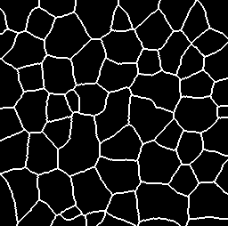
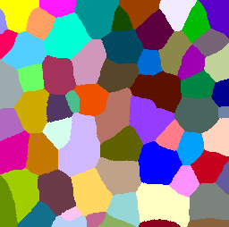
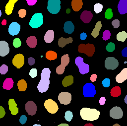

# Label maps and Voronoi Diagrams
Author: Robert Haase, June 2020

[Source](https://github.com/clij/clij2-docs/tree/master/src/main/macro/labelmap_voronoi.ijm)


This macro demonstrates different ways for 
applying voronoi diagrams to label maps.

[Voronoi](https://en.wikipedia.org/wiki/Voronoi_diagram) diagrams allow partitioning space 
between points, or labelled regions. Depdening on which input you have,
different voronoi methods may allow you to process it.

```java

// initialize GPU
run("CLIJ2 Macro Extensions", "cl_device=");
Ext.CLIJ2_clear();

run("Close All");

```

## 
Binary image to voronoi-label-map
Assuming our input data is a binary image and we want to label the objects in it 
(connected components labelling) and afterwards partion the space between them.

This is our input image:

```java
run("Blobs (25K)");
input = getTitle();
Ext.CLIJ2_push(input);
close();
Ext.CLIJ2_thresholdOtsu(input, binary_image);
Ext.CLIJ2_pullBinary(binary_image);
```
<a href="image_1593018890549.png"></a>

We can use this method to retrieve a voronoi-label-map from the binary image:

```java
Ext.CLIJ2_voronoiLabeling(binary_image, voronoi_label_map);
Ext.CLIJ2_pull(voronoi_label_map);
run("glasbey_on_dark");
setMinAndMax(0, 255);
```
<a href="image_1593018890672.png"></a>

## Label map to voronoi-label-map
Alternatively, a label map might serve as starting point image. 

This is our input image:

```java
Ext.CLIJ2_connectedComponentsLabelingBox(binary_image, label_map);
Ext.CLIJ2_pull(label_map);
run("glasbey_on_dark");
setMinAndMax(0, 255);
```
<a href="image_1593018890758.png"></a>

We can then use this strategy to generate the voronoi-label-map:

```java
Ext.CLIJ2_extendLabelingViaVoronoi(label_map, voronoi_label_map2);
Ext.CLIJ2_pull(voronoi_label_map2);
run("glasbey_on_dark");
setMinAndMax(0, 255);
```
<a href="image_1593018890902.png"></a>


```java
run("Close All");
```

## Binary image to binary Voronoi diagram
The more classical representation of the Voronoi diagram is a 
binary image where the edges between the partitioned regions have
non-zero values while the rest of the image has zero pixels.

This is our input image:

```java
Ext.CLIJ2_pullBinary(binary_image);
```
<a href="image_1593018891000.png"></a>

Starting from a binary image, you can use this method:

```java
Ext.CLIJ2_voronoiOctagon(binary_image, binary_voronoi);
Ext.CLIJ2_pullBinary(binary_voronoi);
```
<a href="image_1593018891104.png"></a>


```java
run("Close All");
```

## Voronoi label map to binary voronoi diagram
Alternatively, you can process a binary voronoi diagram out of a voronoi label map.

This is our input image:

```java
Ext.CLIJ2_pull(voronoi_label_map2);
run("glasbey_on_dark");
setMinAndMax(0, 255);
```
<a href="image_1593018891235.png"></a>

From which we can generate this voronoi diagram:

```java
Ext.CLIJ2_detectLabelEdges(voronoi_label_map2, binary_voronoi2);
Ext.CLIJ2_pullBinary(binary_voronoi2);
```
<a href="image_1593018891288.png"></a>


```java
run("Close All");
```

## Label map to binary voronoi diagram
You can also start from a label map, extend it until labels touch and then derive a binary voronoi diagram.

This is our input image:

```java
Ext.CLIJ2_pull(label_map);
run("glasbey_on_dark");
setMinAndMax(0, 255);
```
<a href="image_1593018891418.png"></a>

And this is how you can derive a binary voronoi diagram from it:

```java
Ext.CLIJ2_voronoiOctagon(binary_image, binary_voronoi3);
Ext.CLIJ2_pullBinary(binary_voronoi3);

```
<a href="image_1593018891561.png"></a>

At the end of the macro, clean up:

```java
Ext.CLIJ2_clear();

```


```
```
