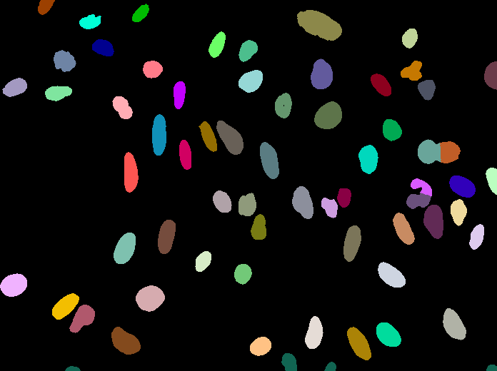
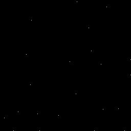
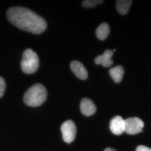
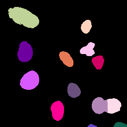

# Voronoi Otsu Labeling
Author: Robert Haase, May 2021

[Source](https://github.com/clij/clij2-docs/tree/master/src/main/macro/voronoi_otsu_labeling.ijm)

This workflow for image segmentation is a rather simple and yet powerful approach, e.g. for detecting and segmenting nuclei in fluorescence micropscopy images. A nuclei marker such as nuclei-GFP, DAPI or histone-RFP in combination with various microscopy techniques can be used to generate images of suitable kind.

To demonstrate the workflow, we used image set [BBBC022v1](https://bbbc.broadinstitute.org/bbbc/BBBC022) [Gustafsdottir et al., PLOS ONE, 2013](http://dx.doi.org/10.1371/journal.pone.0080999), available from the Broad Bioimage Benchmark Collection [Ljosa et al., Nature Methods, 2012](http://dx.doi.org/10.1038/nmeth.2083).

We start by opening an example image and cropping out an interesting sub-region.

```java
run("Close All");
// Init GPU
run("CLIJ2 Macro Extensions", "cl_device=");
Ext.CLIJ2_clear();

open("C:/structure/code/clij2-docs/src/main/resources/BBBC022/IXMtest_A01_s1_w164FBEEF7-F77C-4892-86F5-72D0160D4FB2.tif");
input_image = getTitle();
run("32-bit"); // that's necessary to retrieve a reasonable spot detection result

Ext.CLIJ2_push(input_image);

// crop and visualize
Ext.CLIJ2_crop2D(input_image, crop_image, 400, 00, 256, 256);
Ext.CLIJ2_pull(crop_image);
```
<a href="image_1621874721153.png"></a>
<a href="image_1621874722023.png"></a>

## Applying the algorithm
Voronoi-Otsu-labeling is a command, which asks for two sigma parameters. 
The first sigma controls how close detected cells can be (`spot_sigma`) 
and second controls how precise segmented objects are outlined (`outline_sigma`).

```java
sigma_spot_detection = 5;
sigma_outline = 1;
Ext.CLIJ2_voronoiOtsuLabeling(input_image, label_image, sigma_spot_detection, sigma_outline);
Ext.CLIJ2_voronoiOtsuLabeling(crop_image, crop_label_image, sigma_spot_detection, sigma_outline);

Ext.CLIJ2_pull(label_image);
run("glasbey_on_dark");
Ext.CLIJ2_pull(crop_label_image);
run("glasbey_on_dark");
```
<a href="image_1621874722333.png"></a>
<a href="image_1621874722395.png"></a>

## How does it work?
The Voronoi-Otsu-Labeling workflow is a combination of Gaussian blur, spot detection, 
thresholding and binary watershed. The interested reader might want to see the 
[open source code](https://github.com/clij/clij2/blob/master/src/main/java/net/haesleinhuepf/clij2/plugins/VoronoiOtsuLabeling.java).

Note: If this algorithm is applied to 3D data, it is recommended to make it isotropic first.

As a first step, we blur the image with a given sigma and detect maxima in the resulting image.

```java
Ext.CLIJ2_gaussianBlur2D(crop_image, blurred_image, sigma_spot_detection, sigma_spot_detection);

// detect maxima (spots)
Ext.CLIJ2_detectMaxima2DBox(blurred_image, detected_spots_image, 0, 0);

// count spots
Ext.CLIJ2_getSumOfAllPixels(detected_spots_image, number_of_spots);
print("number of detected spots", number_of_spots);
// show blurred image
Ext.CLIJ2_pull(blurred_image);
// show image with local maxima
Ext.CLIJ2_pull(detected_spots_image);
setMinAndMax(0, 1);
```
<pre>
> number of detected spots 22
</pre>
<a href="image_1621874722498.png"></a>
<a href="image_1621874722514.png"></a>

Furthermore, we start again from the cropped image and blur it again, with a 
different sigma. Afterwards, we threshold the image using 
[Otsu's thresholding method (Otsu et al 1979)](https://doi.org/10.1109%2FTSMC.1979.4310076).

```java
Ext.CLIJ2_gaussianBlur2D(crop_image, blurred_image, sigma_outline, sigma_outline);
Ext.CLIJ2_thresholdOtsu(blurred_image, binary_image);

// show blurred image
Ext.CLIJ2_pull(blurred_image);
// show binary image
Ext.CLIJ2_pull(binary_image);
setMinAndMax(0, 1);
```
<a href="image_1621874722610.png"></a>
<a href="image_1621874722673.png"></a>

Afterwards, we take the binary spots image and the binary segmentation image 
and apply a binary_and operation to exclude spots which were detected in the 
background area. Those likely corresponded to noise.

```java
Ext.CLIJ2_binaryAnd(detected_spots_image, binary_image, selected_spots_image);
// count selected spots
Ext.CLIJ2_getSumOfAllPixels(selected_spots_image, number_of_spots);
print("number of selected spots", number_of_spots);

// show selected spots image
Ext.CLIJ2_pull(selected_spots_image);
setMinAndMax(0, 1);
```
<pre>
> number of selected spots 13
</pre>
<a href="image_1621874722723.png"></a>

Next, we separate the image space between the selected spots using a 
[Voronoi diagram](https://en.wikipedia.org/wiki/Voronoi_diagram#References)
which is limited to the positive pixels in the binary image.

```java
Ext.CLIJ2_maskedVoronoiLabeling(selected_spots_image, binary_image, voronoi_diagram );

// show binary image
Ext.CLIJ2_pull(binary_image);
setMinAndMax(0, 1);

// show selected spots image
Ext.CLIJ2_pull(selected_spots_image);
setMinAndMax(0, 1);

// show result
Ext.CLIJ2_pull(voronoi_diagram );
run("glasbey_on_dark");
```
<a href="image_1621874722903.png"></a>
<a href="image_1621874722919.png"></a>
<a href="image_1621874722934.png"></a>

Finally, we clean up GPU memory.

```java
Ext.CLIJ2_clear();
```


```
```
